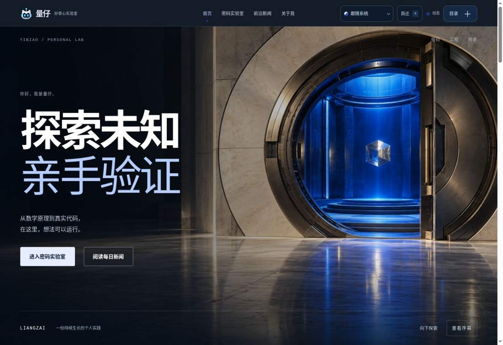
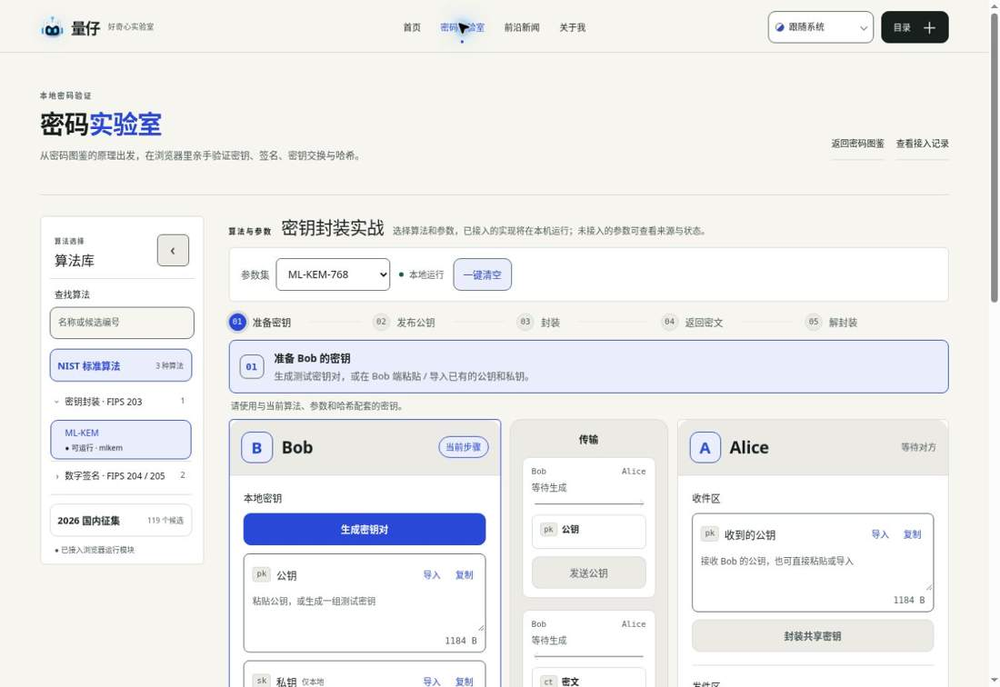
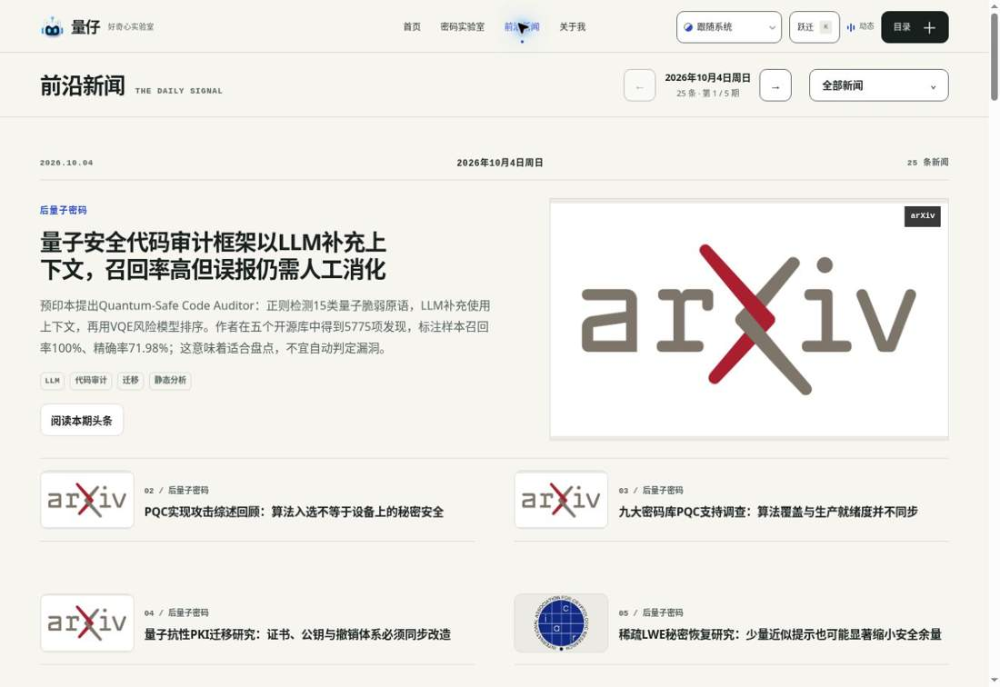
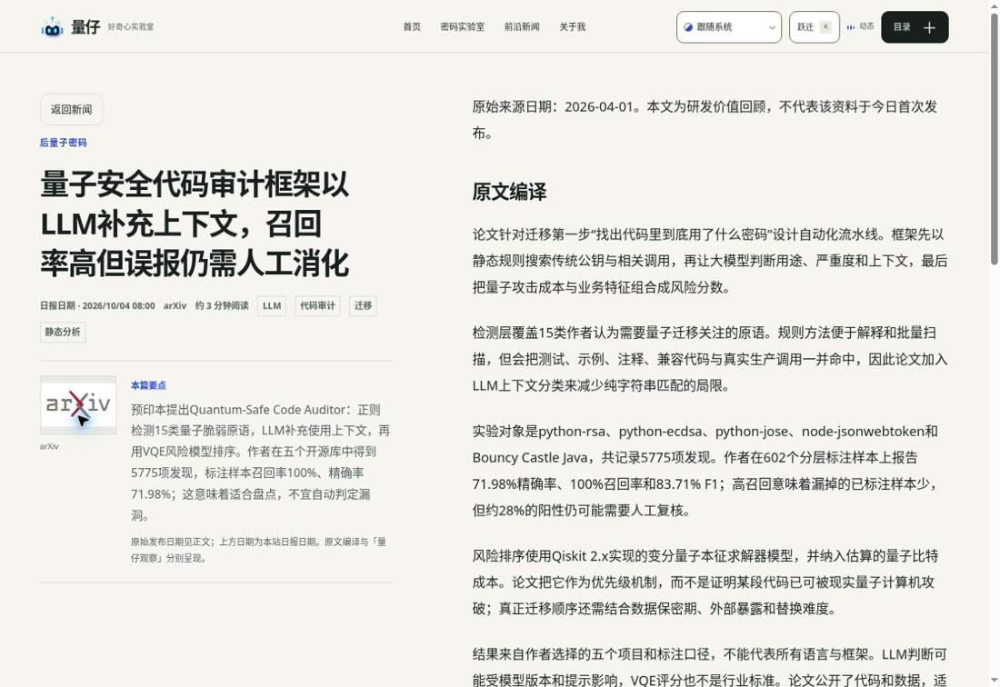
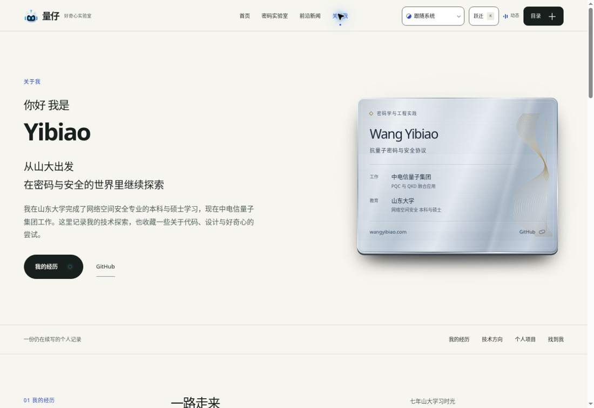
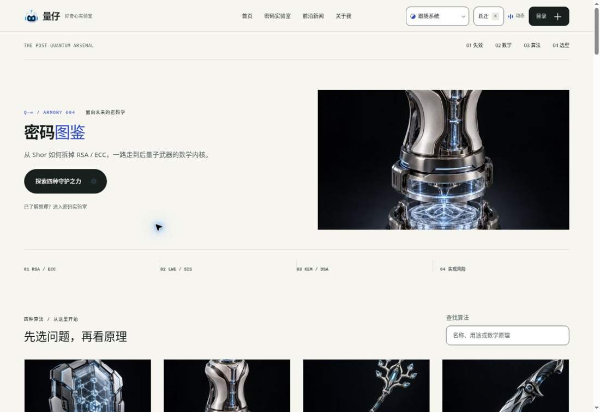

# 量仔网站 UI 与文字审计 · 2026-10-04

本次实际访问 wangyibiao.com，按首页 → 密码实验室 → 新闻列表 → 新闻正文 → 关于我 → 密码图鉴的顺序检查。截图为修复前本次访问所得。保留已有电影序幕、推页转场、功能入口及桌面名片的固定尺寸。

## 先查阅的设计依据

- [W3C 标题结构](https://www.w3.org/WAI/tutorials/page-structure/headings/)：标题语义按内容层次嵌套。
- [GOV.UK 标题规范](https://design-system.service.gov.uk/styles/headings/)：一致的标题样式与清楚的内容结构。
- [IBM Carbon Typography](https://www.carbondesignsystem.com/building-blocks/foundations/typography/overview)：区分表达型展示文字和以任务为中心的产品文字，使用统一字号系统。
- [WCAG 2.2 对比度](https://www.w3.org/WAI/WCAG22/Understanding/contrast-minimum.html)：普通文本 4.5:1，大字 3:1。
- [WCAG 2.2 重排](https://www.w3.org/WAI/WCAG22/Understanding/reflow.html)：320 CSS px 宽度下检查内容重排，必要的二维内容有例外。
- [WCAG 2.2 目标尺寸](https://www.w3.org/WAI/WCAG22/Understanding/target-size-minimum.html)：24×24 CSS px 或满足间距等例外；本项目主要独立操作目标采用 44px。

本次的 14px 控件、16px 正文、13px 辅助文字、中文自然字距和新闻阅读栏宽度是针对本站的设计选择，不是 W3C 强制字号。

## 问题与修复

| 步骤 | 当前健康度与证据 | 问题 | 实施修复 |
|---|---|---|---|
| 1 首页 | 主视觉和入口明确，细节待改 | 顶栏文字偏小；大中文标题负字距过紧；辅助文字过小 | 主导航14px、辅助文字13px；保留大标题，减轻字距压缩；保留序幕 |
| 2 密码实验室 | 功能层级存在，但说明拥挤 | 标签、任务标题、说明同一行；说明及侧栏文字偏小 | 标题/说明分行；统一阅读和控件字号；小屏输入文字16px |
| 3 新闻列表 | 新闻可读，但图片和密度不佳 | 同一来源logo重复充当大图；重点新闻行间4vw空隙；长中文标题紧凑；装饰英文 | 通用logo回退现有关键词配图；分离列距/行距；自然字距与适当行高；删除英文小标题 |
| 4 新闻正文 | 内容完整，阅读顺序待改 | 左侧标题摘要与右侧正文并行竞争；页面标签是通用站名 | 标题→来源→要点→正文的单列阅读；限制阅读行宽；动态文章metadata |
| 5 关于我 | 名片和个人介绍可用 | 次级段落字号偏小；中文章节标题字距压缩 | 提升次级段落字号和章节行高；名片460×356的基准尺寸保留 |
| 6 密码图鉴 | 图鉴与交互功能可用 | 装饰英文与重复箭头抢占注意力；算法标题层级偏大；说明小 | 中文目录；精简装饰；缩小算法身份标题，提升说明和链接可读性 |

附加代码检查：320px下顶栏各控件的最小宽度总和超过可用宽度，改为两行排布；新闻小屏工具栏不再持续固定占据阅读区域。目录弹窗的可访问名称不再依赖小屏被隐藏的预览标题。首页深色顶栏使用明亮键盘焦点边框。

## 截图证据

### 1 首页

### 2 密码实验室

### 3 新闻列表

### 4 新闻正文

### 5 关于我

### 6 密码图鉴

## 验证边界

截图与DOM来自当前云浏览器桌面视口。本地浏览器预览连接被环境策略拒绝；不将CSS静态检查等同于实机验证。仓库CI的既有响应式矩阵覆盖 Chromium/Firefox/WebKit、320–3840px及10条路由；它能检查溢出与操作，不能代替真实设备、屏幕阅读器或完整WCAG符合性审计。以PR检查结果为准。
